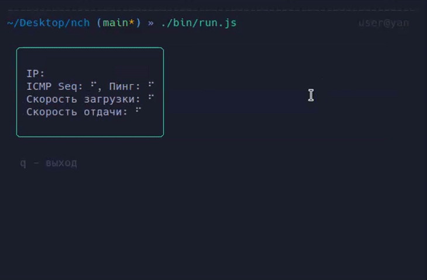

# nch

> Network Checker is a user-friendly CLI (TUI) application that offers real-time IP discovery, ping statistics, and speed testing to optimize your network performance.



## Install

```bash
npm install -g nch
```

## Usage

```bash
$ nch
```
